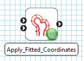
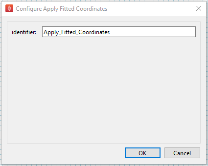

Apply Fitted Coordinates
========================

Overview
--------

The **Apply Fitted Coordinates** is a MAP Client plugin for replacing the *coordinates* coordinate field of a mesh with the *fitted coordinates* coordinate field.

.. _fig-mcp-apply-fitted-coordinates-configured-step:

   A configured *Apply Fitted Coordinates* default step icon.

Specification
-------------

Information on this plugins' specification is available :ref:`here <mcp-applyfittedcoordinates-specification>`.

Configuration
-------------

There are no parameters to set in this plugin except the identifier.

.. _fig-mcp-apply-fitted-coordinates-configure-dialog:

   Apply fitted coordinates step configuration dialog.

Instructions
------------

This is a non-interactive step.
See `Configuration`_.
